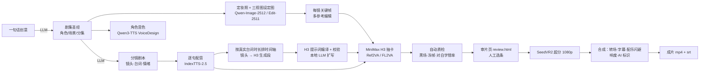

# aidrama：本地 AI 真人短剧流水线（RTX 5090 32GB · 2026-10）

从“一句话创意”到“带字幕、配乐、AI 标识的竖屏成片”，全部在一台 **RTX 5090 32GB + 128GB 内存** 的电脑上完成。
所有画面、表演、对白都用本地开源权重模型生成，不依赖任何付费 API。

- **视频主力**：MiniMax H3（2026-08 开源权重，开源模型里图生视频带音频榜第一，能同时生成表演、口型、音效）
- **角色一致性**：Qwen-Image-2512 定妆照 → Qwen-Image-Edit-2511 三视图设定图 → 多参考关键帧 → H3 Ref2VA 多镜头段 + 关键帧锚定
- **对白**：IndexTTS-2.5 情绪配音（每个角色由 Qwen3-TTS VoiceDesign 设计专属音色）→ 作为 `<Audio 1>` 驱动 H3 口型 → Qwen3-ASR 回读质检
- **后期**：SeedVR2 7B 超分到 1080×1920、MiniMax Music 3 配乐、自动闪避混音、-14 LUFS、字幕避开平台 UI、GB 45438-2025 显式和隐式 AI 标识

为什么这样选，以及“第一梯队”现在具体指什么，请看 [docs/01-调研报告.md](docs/01-调研报告.md)。

---

## 质量定位（实话实说）

| 维度 | 本方案（本地） | 说明 |
|---|---|---|
| 表演、运动、口型 | 开源第一档（MiniMax H3） | 第三方榜单中 H3 开源版和 Seedance 2.0 同一档位，见调研报告 |
| 角色一致性 | 设定图 + 多参考关键帧 + 每个切点 AddGuide 锚定 | 跨集、跨场景依靠同一套设定图；如需更强锁脸，可额外训练角色 LoRA（见 SOP） |
| 分辨率 | 原生 768×1344 → SeedVR2 超分 1080×1920 | H3 官方 2K 重生成只开放 API；本地用 SeedVR2 7B 补细节 |
| 对白 | TTS 先行，口型跟随音轨，ASR 自动质检 | 台词逐字可控，不会冒出随机台词 |
| 平台合规 | 显式标识 + AIGC 元数据 + 字幕安全区 | 备案等流程仍需人工完成，见合规文档 |

**和闭源顶级模型的差距**：Seedance 2.x、Veo、Kling 等闭源模型在复杂动作、写实皮肤细节、2K 原生画质上仍略强。
建议的做法是：全剧本地生成；只有少量关键镜头（打戏、大场面），才考虑花钱用 API 重做。具体见 [docs/03-工作流SOP.md](docs/03-工作流SOP.md) 中的“付费增强”一节。

## 流水线



每个阶段都可以单独重跑；所有产物、种子和实际提交的 ComfyUI 工作流都记录在工程目录里，方便返工和留档。

## 快速开始

### 1. 安装（一次性，约 2–4 小时，主要是下载约 160GB 模型）

**Windows 10/11**（在仓库根目录打开 PowerShell）：

```powershell
powershell -ExecutionPolicy Bypass -File install\windows\install.ps1
# 国内网络：
powershell -ExecutionPolicy Bypass -File install\windows\install.ps1 -Source modelscope -PipMirror tuna
```

**Linux（推荐 Ubuntu 22.04/24.04）**：

```bash
bash install/linux/install.sh
# 国内网络：
bash install/linux/install.sh --source modelscope --pip-mirror tuna
```

装好的内容包括：ComfyUI v0.38.2（Python 3.13 + PyTorch cu130）、全部模型、IndexTTS-2.5、Qwen3-TTS/ASR、Ollama 本地大模型、思源黑体，最后会自动跑一遍测试。
详细步骤和每一步出错时的处理办法见 [docs/02-安装部署.md](docs/02-安装部署.md)。

> 纯本地运行建议用 Linux。Windows 上 PyTorch 锁页内存的上限是物理内存的 40%（128GB 机器约 51GB），H3 这类大模型换入换出会更慢。

### 2. 启动服务并体检

```powershell
powershell -ExecutionPolicy Bypass -File install\windows\start_all.ps1   # Windows
.\aidrama.bat doctor
```

```bash
bash install/linux/start_all.sh                                         # Linux
./aidrama.sh doctor
```

`doctor` 会逐项检查：ffmpeg、ComfyUI 版本和节点、各组模型文件是否齐全、音频服务、LLM、官方提示词指南。

第一次装好后，再跑一次**真机冒烟测试**（约 10–15 分钟）：

```bash
./aidrama.sh smoke          # Windows：.\aidrama.bat smoke
```

它会让每个模型都用最小参数真正推理一次，包括 Qwen 文生图和编辑、H3 FL2VA 和 Ref2VA、SeedVR2、Music 3、配音和识别。
跑完打印每一项的耗时和结果，用来确认模型能加载、显存够用。

### 3. 跑示例《第七封信》（30 秒，2 场 8 个镜头，含两人对白）

```bash
./aidrama.sh init-demo projects/demo        # Windows 用 .\aidrama.bat
./aidrama.sh run projects/demo ep01         # 全流程一键跑完
# 打开 projects/demo/episodes/ep01/review.html 审片，不满意的段重抽或改选：
./aidrama.sh video projects/demo ep01 --only ep01_g02 --takes 4
./aidrama.sh pick  projects/demo ep01 ep01_g02 3
./aidrama.sh upscale projects/demo ep01 && ./aidrama.sh assemble projects/demo ep01
```

成片在 `projects/demo/episodes/ep01/out/ep01.mp4`（另有不烧字幕的 `ep01_clean.mp4` 和 `ep01.srt`）。

### 4. 做自己的剧

```bash
./aidrama.sh new projects/myshow --idea "外卖员意外继承百亿遗产，却发现遗嘱里藏着一桩命案" --episodes 10 --seconds 90
./aidrama.sh storyboard projects/myshow ep01     # 生成分镜后，先人工检查和修改 project.yaml
./aidrama.sh run projects/myshow ep01
```

完整的制作 SOP、每一步应该人工看什么、怎么返工，见 [docs/03-工作流SOP.md](docs/03-工作流SOP.md)。

## 画质预设与耗时（RTX 5090，估算）

| 预设 | H3 设置 | 一段 8–10 秒（一条） | 一集 90 秒（约 10 段 × 2 条） | 用途 |
|---|---|---|---|---|
| `quality`（默认） | FL2VA 20 步 / Ref2VA 25 步，INT8 注意力 | 约 8–15 分钟 | 视频约 3–6 小时，全流程约 5–8 小时 | 成片 |
| `balanced` | FL2VA 官方 Turbo 8 步 LoRA；Ref2VA 不用 LoRA、16 步 | 约 3–8 分钟 | 全流程约 2.5–4 小时 | 日更、跑量 |
| `draft` | FL2VA 用 FastH3（8 步 + VSA 稀疏注意力）；Ref2VA 用 4 步 LoRA，512×896 | 约 1–2 分钟 | 约 30–60 分钟 | 预演节奏和调度（4 步 LoRA 会损伤对白音质，只用于看画面） |

以上是根据社区在 5090 上的数据推算的：1280×704、5 秒、Turbo 8 步加 INT8 注意力实测约 79 秒；不加速 20 步约 270 秒（社区外推值）。**云端没有 GPU，未实测**。
建议用夜间批量跑 `quality`；可以用 `--preset balanced` 快速过一遍，再对选中的段用 `quality` 重抽。

## 目录结构

```
aidrama/            编排器（Python 包）
  graphs/           各阶段 ComfyUI 工作流构建器（H3 / Qwen 图像 / SeedVR2 / 配乐 / InfiniteTalk / Wan Animate 2）
  h3prompt.py       H3 提示词编译器 + 校验器（按官方格式，台词逐字锁定）
  planner.py        镜头 → H3 生成段（按真实配音时长排时间轴、选参考图、定锚点）
  pipeline.py       各阶段编排、显存调度（ComfyUI / 音频 / LLM 轮流占用显卡）、抽卡与选优
  assemble.py       ffmpeg 合成：转场、字幕、BGM 闪避、响度、AI 标识
configs/
  default.yaml      常用参数及注释（工程目录里放 aidrama.yaml 只覆盖需要改的项）
  models.yaml       模型清单：文件名、体积、下载地址、许可证
services/audio_server.py   本地音频服务（IndexTTS-2.5 / Qwen3-TTS / Qwen3-ASR）
scripts/            download_models.py（断点续传 + 国内镜像）、comfy_validate.py（用 ComfyUI 自己校验工作流）
install/            Windows / Linux 一键安装、启动、停止脚本
workflows/          13 个可直接拖进 ComfyUI 的 API 工作流（手动调试和单独出图用）
examples/第七封信/  示例工程
docs/               调研报告、安装、SOP、提示词、质检、常见问题、合规；docs/research/ 是原始调研笔记
tests/              单元测试 + 全流程模拟测试
```

## 云端验证了什么、没验证什么

这套流程是在没有 GPU、也无法访问 HuggingFace 的云端容器里开发的，因此：

- **已验证**
  - 流水线实际提交的全部 ComfyUI 工作流都用真实的 ComfyUI v0.38 `validate_prompt` 校验通过，三档预设（quality / balanced / draft）都覆盖了。这批工作流包括：
    - `workflows/` 下的 13 个；
    - 示例工程三档预设各跑一遍生成的工作流；
    - `smoke` 冒烟测试的 6 个。
  - 关键参数逐项对照了 ComfyUI 官方模板（comfyui-workflow-templates 0.11.74）：采样器、步数、CFG、shift、LoRA 搭配、分辨率等。
  - ComfyUI 客户端和真实 ComfyUI 实例联调过，包括断线重连、任务丢失检测、错误上报。
  - 音频服务的 HTTP 接口跑通过。
  - 模型下载器在本地模拟服务上测过：续传、限流返回的错误页、Git LFS 指针文件、416 响应。
  - Linux 启动/停止脚本和 `doctor` 在真实 ComfyUI（CPU 模式）上跑通过，包括路径带空格的情况。
  - PowerShell 脚本过了 PowerShell 解析器检查，并检查了 UTF-8 BOM。
  - 全流程“模拟模式”（`--mock`）可以产出 1080×1920、-14 LUFS、带字幕、AI 标识和 AIGC 元数据的成片。
  - 共 44 个自动化测试，其中 16 个是代码审查发现问题后补的回归测试。
- **未验证**：真实模型推理的画质和速度，需要在你的 5090 上跑。第一次请先跑示例工程，并按 [docs/05-质检与返工.md](docs/05-质检与返工.md) 检查结果。
- 安装脚本里的 Windows 部分只做过语法检查，没有在 Windows 机器上实际执行。遇到问题请看 [docs/06-常见问题.md](docs/06-常见问题.md)。

## 文档

| 文档 | 内容 |
|---|---|
| [01-调研报告](docs/01-调研报告.md) | 2026-10 AI 短剧行业现状、第一梯队标准、模型格局与选型理由 |
| [02-安装部署](docs/02-安装部署.md) | 一键安装、手动安装、国内网络、LLM 选择、目录说明 |
| [03-工作流SOP](docs/03-工作流SOP.md) | 从创意到成片的每一步：命令、产物、人工检查点、返工、兜底方案 |
| [04-提示词指南](docs/04-提示词指南.md) | 分镜字段怎么写、H3 提示词结构、人工改写 |
| [05-质检与返工](docs/05-质检与返工.md) | 平台硬伤清单、自动质检、审片、返工决策表 |
| [06-常见问题](docs/06-常见问题.md) | 安装、显存、速度、画质、口型、音频问题排查 |
| [07-合规与授权](docs/07-合规与授权.md) | 备案、AI 标识、各模型许可证、肖像和声音 |

## 许可

本仓库代码以 MIT 许可发布。各模型的权重有各自的许可证，例如：

- MiniMax H3 Community License 有营收门槛和地域限制；
- Qwen-Image-2.1 仅限非商用，所以默认没有启用。

商用前请务必阅读 [docs/07-合规与授权.md](docs/07-合规与授权.md)。
